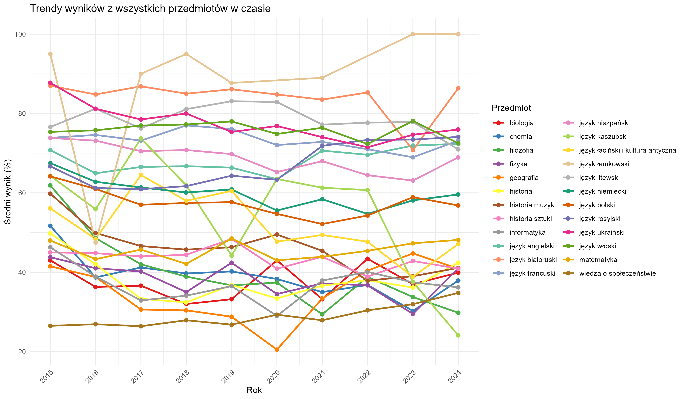
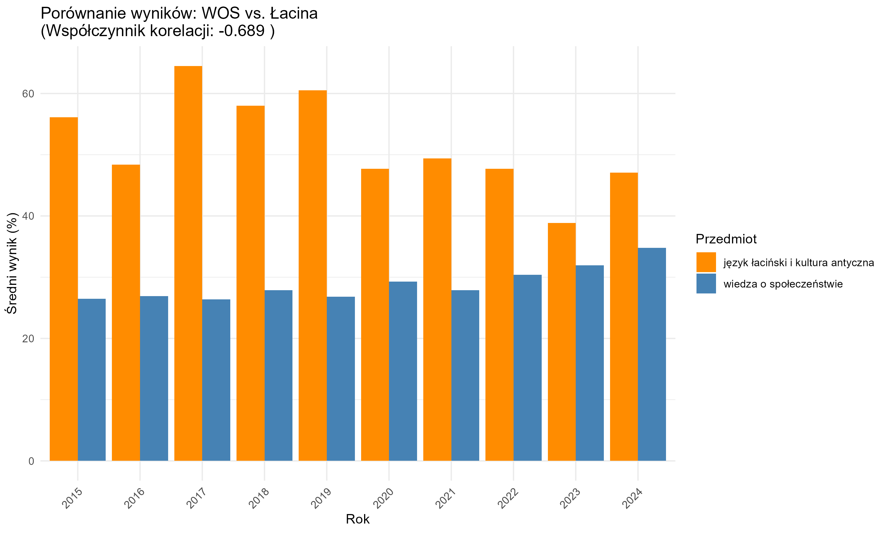

```{r, include=FALSE}
knitr::opts_chunk$set(
  echo = FALSE,
  warning = FALSE,
  tidy = FALSE,
  message = FALSE,
  fig.align = 'center',
  out.width = "100%"
)
options(knitr.table.format = "html") 
```

---

::: {.column width="100%"}

<div style="background-color:#104F4F; color:white; padding:22px; margin-top:10px; text-align:center; font-weight:bold; border-radius:4px; font-size:34px;">
Wstęp
</div>

<div style="font-size:34px; padding:16px; text-align:justify;">
Celem projektu jest analiza średnich wyników egzaminów maturalnych w Polsce w latach 2015–2024. Analiza pozwala zidentyfikować trendy, różnice między grupami zdających oraz zależności pomiędzy poszczególnymi przedmiotami.  
Projekt nie tylko przedstawia zmiany w poziomie osiągnięć uczniów, ale także wskazuje czynniki mogące wpływać na wyniki oraz ilustruje, jak korelują ze sobą wybrane przedmioty maturalne.
</div>

<div style="font-size:34px; padding:8px 16px 16px 16px;">
<strong>Projekt może być przydatny dla:</strong>
<ul style="margin-top: 6px; margin-bottom: 0;">
  <li>nauczycieli – do oceny skuteczności nauczania i planowania pracy dydaktycznej,</li>
  <li>uczniów – do porównania własnych wyników z trendami ogólnopolskimi,</li>
  <li>rodziców – do lepszego zrozumienia osiągnięć dzieci,</li>
  <li>osób zainteresowanych edukacją i polityką oświatową.</li>
</ul>
</div>

:::

::: {.column width="100%"}

<div style="background-color:#104F4F; color:white; padding:20px; margin-top:10px; text-align:center; font-weight:bold; border-radius:4px; font-size:32px;">
Metody analizy i przetwarzania danych
</div>

<div style="font-size:34px; padding:12px; text-align:justify;">
Analiza obejmuje kilka kluczowych etapów:
<ul style="margin-top: 6px;">
  <li><b>Wczytanie i oczyszczenie danych</b> – usunięcie brakujących lub błędnych wartości, standaryzacja nazw przedmiotów.</li>
  <li><b>Agregacja i grupowanie</b> – obliczanie średnich wyników według lat, przedmiotów i płci.</li>
  <li><b>Obliczanie korelacji</b> – wyznaczenie współczynników korelacji pomiędzy wynikami z różnych przedmiotów.</li>
  <li><b>Wizualizacja</b> – prezentacja wyników w formie wykresów i heatmap.</li>
</ul>
</div>

<div style="font-size:26px; padding:8px 16px 16px 16px;">
<strong>Przykład transformacji danych (R):</strong>
</div>

```{r, echo=TRUE, eval=FALSE}
# Grupowanie i obliczanie średnich wyników
data_general %>%
  group_by(rok, przedmiot) %>%
  summarise(wartosc = mean(as.numeric(wartosc), na.rm = TRUE))
```

<div style="font-size:26px; padding:8px 16px 16px 16px;">
<strong>Wykorzystane funkcje i pakiety:</strong> <br>
<code>dplyr</code> (group_by, summarise, mutate, filter), <code>tidyr</code> (pivot_wider), <code>ggplot2</code> (wizualizacje), <code>cor</code> (korelacje)
</div>

:::

::: {.column width="100%"}

<div style="background-color:#104F4F; color:white; padding:22px; margin-top:10px; text-align:center; font-weight:bold; border-radius:4px; font-size:34px;">
Dynamika średnich wyników egzaminu maturalnego według przedmiotów
</div>

```{r}
knitr::include_graphics("srednie_wyniki_anim.gif")
```
  
Animowany wykres przedstawia zmiany średnich wyników maturalnych z różnych przedmiotów w latach 2015–2024, ukazując ich poziomy i różnice w czasie.


**Podsumowanie:**  
Na podstawie animacji można stwierdzić, że niektóre przedmioty (np. języki obce) utrzymują wysokie wyniki przez lata, podczas gdy inne wykazują większe wahania. Ogólnie zauważalna jest tendencja wzrostowa w wielu dziedzinach.

:::

::: {.column width="100%" .second-column}

<div style="background-color:#104F4F; color:white; padding:22px; margin-top:10px; text-align:center; font-weight:bold; border-radius:4px; font-size:34px;">
Trendy średnich wyników egzaminu maturalnego w czasie
</div>

```{r}

```

Wykres liniowy przedstawia zmiany średnich wyników egzaminów maturalnych z poszczególnych przedmiotów na przestrzeni lat 2015–2024. Każda linia reprezentuje jeden przedmiot. Pozwala to zidentyfikować tendencje: wzrosty, spadki oraz stabilne poziomy wyników.

**Podsumowanie:**  
Dla wielu przedmiotów widoczna jest stopniowa poprawa wyników, jednak niektóre wykazują zmienność lub spadki w wybranych latach. Obserwowane trendy mogą odzwierciedlać zmiany w poziomie trudności egzaminów, programie nauczania lub przygotowaniu uczniów.

:::

---


::: {.column width="100%"}

<div style="height:36px;"></div>

<div style="background-color:#104F4F; color:white; padding:22px; margin-top:0px; text-align:center; font-weight:bold; border-radius:4px; font-size:34px;">
Średnie różnice wyników egzaminu maturalnego według płci
</div>

```{r}


```
 
Wykres pokazuje średnią różnicę wyników maturalnych między kobietami a mężczyznami dla każdego przedmiotu, gdzie kolor karmazynowy oznacza przewagę kobiet, a jasnoniebieski – mężczyzn.

**Podsumowanie:**  
Analiza wykazuje, że kobiety osiągają znacząco lepsze wyniki w takich przedmiotach jak historia muzyki, język kaszubski czy język litewski, natomiast mężczyźni przeważają w chemii, WOS-ie i historii.

:::

::: {.column width="100%" .third-column}

<div style="height:-10px;"></div>


<div style="background-color:#104F4F; color:white; padding:22px; margin-top:10px; text-align:center; font-weight:bold; border-radius:4px; font-size:34px;">
Macierz korelacji między średnimi wynikami z przedmiotów
</div>

```{r}
knitr::include_graphics("heatmapa_korelacji.png")
```
 
Heatmapa przedstawia współczynniki korelacji pomiędzy średnimi wynikami z poszczególnych przedmiotów maturalnych. Kolor ciemnoczerwony oznacza dodatnią korelację (im silniejsza, tym ciemniejszy kolor), natomiast jasne obszary wskazują na brak związku między przedmiotami.  
Wizualizacja pozwala szybko zidentyfikować grupy przedmiotów, które osiągają podobne wyniki wśród zdających – na przykład języki obce, przedmioty ścisłe lub humanistyczne.

**Podsumowanie:**  
Najsilniejsze korelacje obserwujemy m.in. między językami obcymi, a także pomiędzy matematyką i informatyką. Brak korelacji dotyczy najczęściej przedmiotów rzadziej wybieranych lub bardzo specyficznych, takich jak historia muzyki czy język łaciński.

:::

::: {.column width="100%" .third-column}

<div style="background-color:#104F4F; color:white; padding:14px; margin-top:10px; text-align:center; font-weight:bold; border-radius:4px; font-size:31px;">
Porównanie wyników: przykłady silnej ujemnej i dodatniej korelacji między przedmiotami
</div>

<div style="display: flex; flex-wrap: wrap; justify-content: center; gap: 28px;">
<div style="flex: 1; min-width: 340px;">
<b>WOS vs. język łaciński i kultura antyczna (ujemna korelacja)</b>
<br>
```{r}

```
</div>
<div style="flex: 1; min-width: 340px;">
<b>Język hiszpański vs. język niemiecki (dodatnia korelacja)</b>
<br>
```{r}
knitr::include_graphics("porownanie_hiszp_niem.png")
```
</div>
</div>

Na wykresach przedstawiono porównanie średnich wyników egzaminu maturalnego dla dwóch par przedmiotów:
<ul>
<li><b>WOS i język łaciński i kultura antyczna</b> – silna ujemna korelacja: gdy wyniki z jednego przedmiotu rosną, z drugiego zwykle spadają.</li>
<li><b>Język hiszpański i język niemiecki</b> – silna dodatnia korelacja: wysokie wyniki z jednego przedmiotu idą w parze z wysokimi wynikami z drugiego.</li>
</ul>

**Podsumowanie:**  
Wysoka dodatnia korelacja (bliska 1) oznacza, że uczniowie osiągający dobre wyniki z jednego przedmiotu zwykle dobrze radzą sobie i z drugim. Wysoka ujemna korelacja (bliska -1) wskazuje, że wysokie wyniki z jednego przedmiotu często idą w parze z niskimi wynikami z drugiego. Takie zależności mogą wynikać z podobieństwa kompetencji wymaganych na egzaminach lub z wyborów uczniów o różnych profilach zainteresowań.

:::


::: {.column width="100%"}


<div style="background-color:#104F4F; color:white; padding:22px; margin-top:20px; text-align:center; font-weight:bold; border-radius:4px; font-size:34px;">
Wnioski
</div>

<div style="font-size:34px; padding-top:18px;">

Na podstawie przeprowadzonej analizy danych egzaminów maturalnych z lat 2015–2024 można sformułować następujące wnioski:
<ul>
<li>Średnie wyniki z większości przedmiotów wykazują tendencję wzrostową, co może świadczyć o poprawie przygotowania uczniów lub zmianie standardów oceniania.</li>
<li>Kobiety osiągają wyraźnie lepsze wyniki w wielu przedmiotach humanistycznych oraz językowych, natomiast mężczyźni przeważają w wybranych dziedzinach ścisłych.</li>
<li>Przedmioty zbliżone tematycznie często wykazują silną dodatnią korelację wyników, np. języki obce, historia i WOS, matematyka i informatyka.</li>
<li>Porównanie wyników WOS i języka łacińskiego pokazuje zmienność dominacji między przedmiotami w zależności od roku, przy ogólnej przewadze języka łacińskiego.</li>
</ul>

Analiza potwierdza, że dane maturalne zawierają cenne informacje o tendencjach edukacyjnych oraz różnicach między grupami zdających.

</div>

:::

::: {.column width="100%"}

<div style="background-color:#104F4F; color:white; padding:22px; margin-top:10px; text-align:center; font-weight:bold; border-radius:4px; font-size:34px;">
Bibliografia
</div>

Dane do analizy pochodzą z oficjalnych raportów <strong>Centralnej Komisji Egzaminacyjnej</strong> (CKE), dostępnych publicznie na stronie:  

<a href="https://www.cke.gov.pl/egzamin-maturalny/egzamin-w-nowej-formule/wyniki/">https://www.cke.gov.pl/egzamin-maturalny/egzamin-w-nowej-formule/wyniki/</a>  

Zawierają one szczegółowe wyniki egzaminów maturalnych w Polsce w latach 2015–2024.

:::
